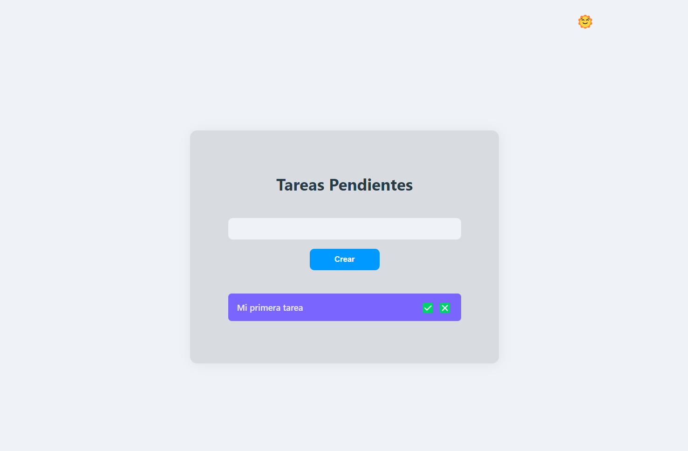
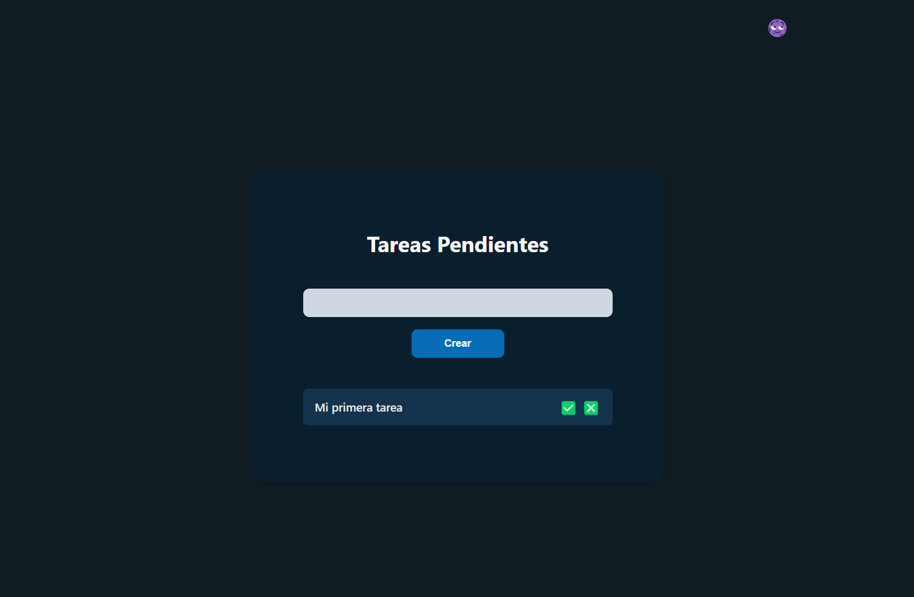

# Todo List

Proyecto que te permite crear, gestionar y marcar tareas como completadas o eliminarlas según sea necesario. Todas las tareas se almacenarán localmente en el navegador utilizando **localStorage**.

## Tecnologías Utilizadas

<div>
  
  
  
  
</div>

## Estructura del proyecto

```
.
├── assets
│   ├── icons
│   │   ├── css.svg
│   │   ├── git.svg
│   │   ├── html.svg
│   │   ├── js.svg
│   │   └── todo-list.svg
│   └── img
│       ├── dark-theme.webp
│       └── light-theme.webp
├── src
│   ├── scripts
│   │   ├── index.js
│   │   └── theme.js
│   └── styles
│       ├── index.css
│       └── theme.css
├── .gitignore
├── index.html
└── README.md
```

## Instalación

1. Clona este repositorio

```bash
$ git clone https://github.com/anibalcoder/todo-list.git
```

2. Abre Visual Studio Code

```bash
$ code .
```

3. Visualiza el proyecto

Abre el archivo **index.html** en tu navegador web.

## Temas

El proyecto utiliza dos esquemas de colores: Uno para el tema claro y otro para el tema oscuro.

### Tema Claro

 <br/>

- Fondo del documento: `hsl(214, 26%, 95%)`
- Fondo de las tareas: `hsl(214, 10%, 86%)`
- Color del título de las tareas: `hsl(205, 30%, 22%)`
- Fondo del campo de texto de las tareas: `hsl(214, 26%, 95%)`
- Fondo de botón Crear Tarea: `hsl(204, 100%, 50%)`
- Fondo de la tarea: `hsl(248, 100%, 70%)`

### Tema Oscuro

 <br/>

- Fondo del documento: `hsl(205, 33%, 10%)`
- Fondo de las tareas: `hsl(205, 64%, 11%)`
- Color del título de las tareas: `hsl(0, 0%, 98%)`
- Fondo del campo de texto de las tareas: `hsl(214, 26%, 85%)`
- Fondo de botón Crear Tarea: `hsla(205, 96%, 43%, 0.8)`
- Fondo de la tareas: `hsl(207, 58%, 19%)`